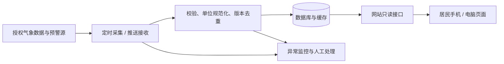

# 沿海居民台风实时信息网站项目计划书

版本：V1.0  
编制日期：2026年9月29日  
项目代号：typhoon-coastal-info  
阶段：立项与需求规划，尚未接入实时数据或部署网站。

## 一、项目目标与服务对象

建设一个手机上容易看懂、弱网下仍能读取关键信息的台风信息网站。居民进入首页后，应能在约 10 秒内找到四个核心答案：台风名称、当前中心位置、移动方向、中心风力；同时看到所选地区的官方预警和对应防御建议。

主要用户包括沿海家庭、老人及其照护者、社区工作人员，以及需要了解港口和近海风险的居民。网站提供信息查询与官方指引入口，转移、停工、停课等具体安排以当地政府及主管部门通知为准。

规划假设：首期采用简体中文、北京时间，服务中国大陆沿海地区；先在一个省的 2–3 个城市及其区县试点，再扩展覆盖。港澳台及其他地区如纳入服务，需分别接入当地预警制度，不能直接套用大陆四级信号。

### 成功指标

- 可用性测试中至少 8/10 名试用者能在 10 秒内找到四项核心信息。
- 所有实时卡片和预报卡片都可追溯到来源与对应时间。
- 所有预警均可查看发布机构、适用区域、原文及更新/解除状态。
- 上线前通过数据过期、接口失败、预警升级、降级和解除的演练。

## 二、首版范围与后续迭代

| 优先级 | 功能 | 交付要求 |
| --- | --- | --- |
| P0 | 城市/区县选择 | 默认让用户选择，记住上次选择；定位需用户主动授权，失败可手动选地区 |
| P0 | 台风概况 | 名称、编号、强度等级、中心经纬度、中心最大风速/风力、数据时刻 |
| P0 | 去向说明 | 移动方向、移动速度、机构发布的趋势描述；无信息时明确缺失 |
| P0 | 台风地图 | 当前中心、历史路径、单一权威来源的预报路径、时效点和图例 |
| P0 | 本地分级预警 | 蓝/黄/橙/红、适用区域、机构、发布时间、状态、原文入口 |
| P0 | 行动建议 | 与官方指南对应的居民版简明说明；地方通知优先展示 |
| P0 | 可靠性状态 | 无台风、无有效预警、数据未知、过期、断网等独立状态 |
| P0 | 多台风场景 | 列表选择与地图切换，所有卡片同步切换，避免混用数据 |
| P1 | 本地风雨及关联灾害 | 有授权数据后接入当地风雨、暴雨、风暴潮等，分别标明主管来源 |
| P1 | 订阅通知 | 按地区订阅更新，明确权限、退订、去重和送达限制 |
| P1 | 历史回放与分享 | 历史路径回放；分享卡片包含来源、时刻和原始页面链接 |
| P2 | 多机构路径、更多地区 | 按来源独立切换；配备各地规则与数据适配器 |

首版不自研气象预测模型，不自行发布官方预警，不实现付费短信、社区聊天或复杂账号体系。首版页面打开时可自动刷新；后台通知属于后续功能，不能声称关掉网页仍能持续收到预警。

## 三、居民最关心的四项信息

| 居民问题 | 页面展示 | 数据与解释要求 |
| --- | --- | --- |
| 台风叫什么？ | 中文名、国际名（如有）、官方编号、当前强度等级 | 未命名系统显示官方标识；同名不同年份用唯一编号区分 |
| 现在在哪里？ | 中心经纬度、官方位置描述、地图标记 | 显示观测时刻；可计算距所选城市的直线距离，但标注为网站估算 |
| 往哪里去？ | 中文移动方向、速度（公里/小时）、预报路径和未来时效 | 保留预报起报时间与有效时间；登陆信息只转述机构预测，注明可能变化 |
| 风力多大？ | 中心附近最大风力（级）、最大风速（米/秒），可补充公里/小时 | 中心风力不代表所在城市风力；持续风与阵风分开，缺失字段显示“暂无数据” |

台风强度等级优先使用来源原始分类；不同机构的风速平均时段可能不同，不把数值直接混用。单位换算允许展示，但要保留原单位和口径。

预报时效按数据源实际提供的 24/48/72 小时等展示，不承诺不存在的时效。历史轨迹用实线，预报轨迹用虚线；不得通过平滑动画或插值制造新的“实测中心位置”。

## 四、分级预警方案

### 4.1 预警的权威来源

首页“本地台风预警”展示气象部门针对选定地区正式发布的预警信号。网站不根据台风中心风速、距离阈值或预测路径自动生成蓝、黄、橙、红官方信号。

全国台风预警产品与地方台风预警信号应按产品类型分开展示。当地有不同的适用标准或防御要求时，保留当地原文和依据。下表是已核对的中国气象局通用信号标准摘要，用于解释颜色含义，不作为网站自行发警的算法。

### 4.2 四级信号与居民提示

下列标准均包含“可能或者已经受热带气旋影响”的条件；风力指标针对受影响沿海或陆地，需连同“并可能持续”等原文条件理解。[官方标准与防御指南][cma-warning]

| 等级 | 官方标准摘要 | 面向居民的提示摘要 |
| --- | --- | --- |
| 蓝色 | 24小时内，平均风力达6级以上，或者阵风8级以上并可能持续 | 做好防台准备；停止高空等户外危险作业；在安全条件下加固门窗、收妥易坠物 |
| 黄色 | 24小时内，平均风力达8级以上，或者阵风10级以上并可能持续 | 切勿随意外出；照顾老人儿童；危房人员按安排及时转移；关注港口和出行通知 |
| 橙色 | 12小时内，平均风力达10级以上，或者阵风12级以上并可能持续 | 尽可能留在防风安全处；关注当地停课停业及转移安排；防范强降水次生灾害 |
| 红色 | 6小时内，平均风力达12级以上，或者阵风14级以上并可能持续 | 留在防风安全处，按政府安排避险或转移；中心经过时短暂平静不代表危险解除 |

以上行动建议是摘要，完整防御指南必须可展开阅读。网站不引导居民在强风已到来时外出加固设施，不擅自给出避难点路线、停课决定或撤离指令。

### 4.3 地区匹配与状态变化

- 使用行政区划代码及来源提供的影响区域匹配预警，不能仅按标题中的城市名称搜索。
- 市/省级预警只有在原始适用范围涵盖所选地区时才纳入；区域缺失或映射失败时显示“适用范围待核实”，不判定无预警。
- 同一发布机构、同一事件保留最新有效版本，旧版进入历史；升级、降级、更新、解除都要同步。
- 多个机构或多条有效预警并存时逐条保留。主卡可强调覆盖本地区的最高等级，同时说明来源和范围，不覆盖更具体的地方信息。
- 来源完整、同步正常且确实没有有效条目时，显示“当前数据源未发布覆盖本地区的有效台风预警”，不显示“安全”。
- 断网、鉴权失败或源数据过期时，显示“预警状态暂无法确认”，保留最近一条记录及其时间；接口失败不能推导为解除。
- 有明确有效期的预警到期后移出有效列表并标记“已到期”；是否解除以官方消息为准。无明确有效期的条目不能仅凭本地定时器标成解除。
- 预警颜色同时配中文等级、图标和文字；更新通过辅助技术友好的提示播报，避免闪烁和仅靠颜色传意。

## 五、页面与交互设计

### 5.1 手机首页信息顺序

```text
沿海台风信息站    [选择城市/区县]
本地官方预警：等级 / 状态 / 发布机构 / 时间
居民提示：当前需要关注的行动 + 官方原文
台风切换：名称及编号
四项概况：叫什么 / 在哪里 / 往哪去 / 风力多大
路径地图：历史实线、预报虚线、时效点
更新时间、数据来源、数据状态
完整防御指南 / 官方查询入口
```

桌面端采用信息栏与地图双列；手机端优先显示预警和文字概况。地图延迟加载或失败时，核心信息仍然可读。

### 5.2 使用流程

用户选择地区 → 查看当地预警 → 查看台风概况 → 点击未来时效点查看预报 → 阅读防御指南和官方通知。用户可以随时切换地区；定位不是访问网站的前置条件。

如果没有活跃台风，显示“当前数据源无活跃台风”，仍保留当地预警查询与科普入口；只有在数据有效且覆盖范围明确时才显示该状态。如果有多台风，显示列表并让用户选择，不用未经验证的风险评分宣称某台风最危险。

### 5.3 可访问性与易用性

正文建议不小于 16px，关键操作触控区域至少 44×44px；支持文字放大、键盘导航和屏幕阅读器。普通文字对比度目标达到 WCAG AA。大字模式和减少动画优先于装饰效果。

预报线旁常驻“预报会变化，路径两侧也可能受影响”。只有数据源提供正式概率范围或不确定性图层时才展示相应区域，不能自行画圆锥并声称是官方影响区。风圈只有在来源提供分象限半径时绘制，且解释它不等于实际灾害边界。

## 六、数据接入与实时性

### 6.1 候选数据源与准入条件

台风观测与预报优先考虑中央气象台/国家气象信息中心的授权服务；地区预警优先考虑官方预警发布渠道或获得授权的气象服务商；地图使用具备目标地区服务资质、满足展示许可的供应商。具体接口、账户、费用、配额、再分发权限和覆盖率均需在第1周核实，目前未确认可用。

官方网页可用于核查和提供跳转入口，网页能访问不代表获得后台接口或转售许可。正式运行不依赖未经授权的隐藏接口或高频网页抓取。若尚未取得合适数据，开发环境只能使用醒目标注的演示数据，公开实时服务不得上线。

### 6.2 刷新策略（待按服务合同调整）

| 数据 | 初始工程建议 | 用户可见时间 |
| --- | --- | --- |
| 台风观测和预报 | 后端每5分钟检查新版本，受接口配额和官方发布节奏约束 | 观测时间、预报起报时间、各时效有效时间 |
| 官方预警 | 优先服务商推送；否则在配额允许时每1分钟检查 | 发布、更新、有效期及最近同步时间 |
| 前端页面 | 可见页面每60秒读取本方缓存，返回前台时刷新；失败指数退避 | 最近获取时间与状态 |

“实时”指及时同步来源已经发布的数据，不代表官方每分钟生成新观测。来源发布时间和网站获取时间必须分开；重复抓到同一版本不能让旧预报看起来像新发布。

每类数据按来源约定的发布周期和宽限时间配置过期阈值，不使用一个统一分钟数判断全部数据。预警连接连续失败时可先标记“同步异常”；源数据过期与网络故障分别记录。缺少发布节奏时由数据负责人确认阈值，不能默认“永不过期”。

### 6.3 数据校验与降级

校验经纬度范围、经纬顺序、时间时区、单位、唯一编号、重复消息、预报时效顺序和缺失值；异常值隔离并告警，不静默补零。来自不同来源的观测和预报保持各自机构与版本，不能拼成一条貌似统一的路径。

服务故障时使用最近有效缓存并显著标注“截至某时”；不把缓存展示为当前实况。备用源切换需说明来源变化，且提前完成授权和字段口径验证。所有接口均不可用时保留文字状态与官方查询入口。

## 七、技术方案与数据结构

建议采用 Next.js + TypeScript 构建响应式网页与只读接口，使用支持中国大陆合规底图的地图 SDK。PostgreSQL 保存台风时次、预报和预警版本；按需要使用缓存服务。独立定时任务负责拉取与校验，避免每个居民打开网页都请求气象源。



### 核心实体

| 实体 | 主要字段 |
| --- | --- |
| 台风 | source、storm_id、官方编号、名称、活跃状态 |
| 观测点 | storm_id、observed_at、lat、lon、强度、最大风速、平均时段、移动方向/速度、fetched_at |
| 预报批次/点 | storm_id、机构、issued_at、valid_at、lead_hours、位置、预报强度、原始版本 |
| 预警事件/版本 | source_alert_id、事件关联号、发布机构、类型、等级、行政区划/区域、发布时间、有效期、状态、原文、source_url |
| 地区 | 行政区划代码、名称、父级、地图坐标参考系、匹配边界版本 |
| 采集记录 | 数据源、请求结果、最后成功时间、源数据版本、质量标记与错误摘要 |

内部时间统一存 UTC，页面转为北京时间并注明时区。坐标采用明确的源坐标系保存，显示到供应商底图时按其要求转换，防止 WGS84/GCJ-02 混用导致偏移。

拟定本方接口（不是已存在的官方 API）：`GET /api/storms`、`GET /api/storms/{id}`、`GET /api/storms/{id}/track`、`GET /api/warnings?areaCode=...`、`GET /api/data-status`。响应携带 source、issuedAt/observedAt、fetchedAt 和 freshness 等元数据。任何外部密钥仅保存在服务端，地图浏览器 key 需限制域名及额度。

## 八、性能、隐私与运营

- 性能目标：约定测试设备与移动4G网络下，首页核心文字内容 P75 加载时间不高于2.5秒；地图不阻塞首屏。此为验收目标，不是现有实测结果。
- 容量目标：试点按1,000名同时在线用户设计，缓存共享源数据；压测明确请求模型、地图调用量和服务商额度，再确定正式容量。
- 可靠性目标：试点运行期网站可用性目标99.5%；单独统计上游数据可用率、数据陈旧时长和同步延迟，不把页面可访问等同于预警及时。
- 隐私：无需注册即可查看；优先仅在本地保存城市偏好。定位默认不开启，不记录居民精确位置，分析日志不含位置和密钥。
- 上线准备：配置 HTTPS、域名、必要的备案及地图展示要求，落实数据再分发许可和来源标注。
- 运维：监控采集失败、预警状态异常、数据延迟、页面错误和额度；指定一名数据负责人、一名技术值守负责人，台风影响期间明确响应时段与替补。
- 故障操作：暂停有误数据输出 → 标明服务状态 → 提供官方入口 → 回滚问题版本 → 核实源数据后恢复；保留事件记录和复盘。
- 备份：数据库每日备份，保留周期按合同和成本确认；上线前完成一次恢复演练。

## 九、实施排期与人员

基准计划为6周，假设1名全栈开发为主，产品/设计、测试与气象资料核对按需参与。数据授权审批等待时间另计；没有正式数据条件时，不能用演示页面冒充上线完成。

| 阶段 | 时间 | 工作与交付 | 通过条件 |
| --- | --- | --- | --- |
| 需求与数据核实 | 第1周 | 确定试点城市、采访居民、字段清单、授权/费用核实 | 关键字段和当地预警可合法获得；否则调整供应商或暂停实时上线 |
| 交互与原型 | 第2周 | 手机首页、地图、预警详情、异常状态原型 | 居民可找到四项核心信息，预警解释无歧义 |
| 数据与页面开发 | 第3–4周 | 数据适配、版本存储、概况、地图、地区预警、缓存 | 首版功能闭环，异常路径可演示 |
| 联调与验收 | 第5周 | 历史事件回放、无障碍检查、弱网/负载测试、运维演练 | 第十一节关键用例全部通过 |
| 小范围试运行 | 第6周 | 试点发布、居民反馈、监控与修正、发布说明 | 无阻断缺陷，负责人和回滚机制到位 |

预计研发工作量约30–45人日，取决于地图集成、供应商接口质量及审核需求。气象资料应由熟悉当地规则的人员复核，不能只由开发者决定预警解释。

## 十、预算估算与主要风险

以下为规划占位估算，单位为人民币，不是供应商报价，也不构成采购授权：

| 项目 | 估算口径 |
| --- | --- |
| 开发、设计、测试 | 30–45人日 × 1,000–2,000元/人日，约3万–9万元；自研时作为工时成本参考 |
| 试点服务器、数据库、缓存、监控 | 约300–1,500元/月；峰值带宽、存储及高可用配置可能增加 |
| 域名 | 约50–150元/年，具体以后缀和续费价格为准 |
| 气象数据、地图商业使用 | 待询价；没有可靠报价，暂不纳入总价 |
| 通知服务 | 首版不含短信；后续按渠道、订阅人数和事件频次另算 |

建议在已确认的建设和运营费用上预留15%–20%机动预算。由于数据和地图费用尚未确定，目前不能给出可靠的完整总预算。

| 风险 | 处理办法 |
| --- | --- |
| 数据授权不足或接口频率太低 | 第1周验证；调整服务承诺、供应商或上线范围 |
| 预警范围错误、旧版本覆盖新版本 | 区划映射测试、版本关联、保留原文与历史、故障告警 |
| 将预报理解为确定登陆路径 | 明确起报时间、虚线和不确定性提示，不自行推算确定登陆时间 |
| 台风期间访问暴增或断网 | 共享缓存、静态资源CDN、文字降级、压测及回滚演练 |
| 当地预警规则与通用标准不同 | 地区规则配置、官方原文优先、逐地核验 |
| 地图位置偏移或授权不合适 | 坐标对照测试、供应商许可核查、保留底图版权信息 |

## 十一、验收清单

以下均为开发完成后需要执行的验收，不代表本次已通过网站测试。

| 编号 | 场景 | 预期结果 |
| --- | --- | --- |
| A01 | 打开首页并选择地区 | 名称、位置、移动方向与速度、中心风力清晰可读，含单位与时间 |
| A02 | 同时存在两个台风 | 切换后卡片、路径、时效点同属一台风，无串数据 |
| A03 | 历史与未来路径 | 实线/虚线明确；未来点有预报时次与有效时间，无伪造实测点 |
| A04 | 当地发出蓝/黄/橙/红预警 | 等级、发布机构、范围、时间、原文与官方记录一致 |
| A05 | 预警升级、降级、更新、解除 | 当前卡片切换到正确版本，历史可追溯；不重复提醒 |
| A06 | 省、市、区县重叠或范围未知 | 保留正确来源和覆盖范围；未知范围不显示为当地已无预警 |
| A07 | 接口断开或数据过期 | 清晰标识状态与最后有效时间，不误报解除或安全 |
| A08 | 空数据与无活跃台风 | 区分确实无记录、请求失败和覆盖不足，官方入口可用 |
| A09 | 单位、时区、坐标与平均风速口径 | 抽样与源数据逐项一致，底图上无明显坐标偏移 |
| A10 | 弱网、地图失败、小屏幕、字体放大 | 核心文字可读，无被遮挡的预警，手动选地区正常 |
| A11 | 负载与上游配额 | 按约定模型压测达到容量目标；不因用户数增加等比例打爆气象源 |
| A12 | 用户拒绝定位 | 核心功能可用，不采集精确位置；前端无服务端密钥 |
| A13 | 重复、乱序和缺字段消息 | 最新有效版本不被覆盖，缺失值不当作0，异常进入监控 |

验收材料包括数据对照记录、异常场景截图、压测配置和报告、无障碍检查结果、授权清单、运维与回滚记录。

## 十二、本次交付与开发启动事项

本次交付：项目计划书、仓库说明、资料来源和数据接入核查表。GitHub 仓库用于存放这些文档及后续代码；当前不包含可运行网站。

开发启动时确认：试点省市、是否必须提供当地风雨、数据与地图预算、正式服务部署地区、上线日期、资料复核与日常值守负责人。建议首先完成真实数据样本验证，再进入地图和预警联调。

[cma-warning]: https://www.cma.gov.cn/2011xzt/2022zt/20220330/2022033011/202204/t20220412_4750940.html
